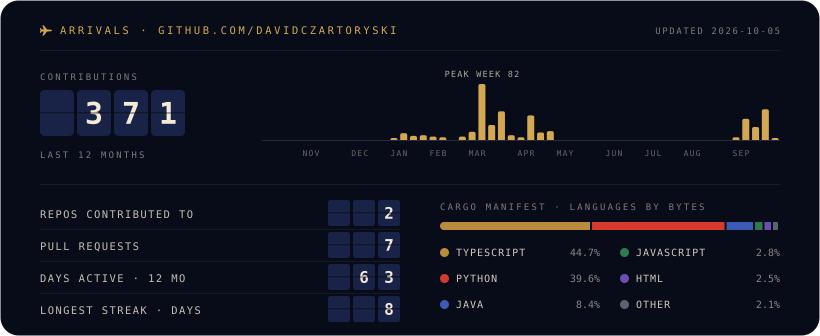

<div align="center">

<p></p>

[](https://davidczartoryski.com) [](https://davidczartoryski.com/resume/DavidCzartoryski_Resume.pdf) [](https://www.linkedin.com/in/davidczartoryski) [](https://www.instagram.com/dczar.ski/) [](mailto:czartoryski.d@northeastern.edu)

</div>

<p align="center"><picture><source media="(prefers-color-scheme: dark)" srcset="./dividers/1-bos-sfo.svg"></picture></p>

<picture><source media="(prefers-color-scheme: dark)" srcset="./headers/01-passport.svg"></picture>

<p></p>

Hi! I'm David. I study Computer Science and Business Administration at Northeastern University in Boston 📍 and graduate in December 2027. Home base is split three ways: Boston, San Francisco, and Warsaw. In 2026 I won 1st place among 250+ participants at the Microsoft x Northeastern AI Hackathon 🏆.

The work that actually pulls me in is making things faster. Profiling a system until the bottleneck shows itself, then optimizing the code around it: latency, runtime, cost, load. Most of what I've shipped is some version of that same problem. A 5-second poll down to 120 ms, 70% off deployment time, 30% off query latency, and now straggler detection across GPU clusters.

Before any of that there was the mat. I won the Massachusetts state wrestling title more than once in high school and I still wrestle at Northeastern. I'm Polish at home, 23 countries in, and I still judge every one of them by its breakfast 🇵🇱.

My portfolio is a passport, boarding pass and theme song included. Take a look 👇

<p align="center"><a href="https://davidczartoryski.com"></a></p>

<p align="center"><picture><source media="(prefers-color-scheme: dark)" srcset="./dividers/2-sfo-waw.svg"></picture></p>

<picture><source media="(prefers-color-scheme: dark)" srcset="./headers/02-flight-log.svg"></picture>

<table>
<tr><td><code>BOS</code></td><td align="center"></td><td><a href="https://github.com/pawtograder"><b>Pawtograder</b></a></td><td>Software Engineer, platform telemetry</td><td>Sep 2026 to now</td></tr>
<tr><td><code>BOS</code></td><td align="center"></td><td><a href="https://github.com/mosaiq-software"><b>Mosaiq Software</b></a></td><td>Full-Stack Software Engineer</td><td>Jan to May 2026</td></tr>
<tr><td><code>SFO</code></td><td align="center"></td><td><a href="https://www.summitpartners.com/"><b>Summit Partners</b></a></td><td>DevOps Engineer Co-op</td><td>Jul to Dec 2025</td></tr>
<tr><td><code>SWK</code></td><td align="center"><picture><source media="(prefers-color-scheme: dark)" srcset="./logos/wca-dark.png"></picture></td><td><a href="https://www.wca.com/"><b>Whalley Computer Associates</b></a></td><td>Network Engineer Intern</td><td>Jun 2023 to Aug 2024</td></tr>
<tr><td><code>BOS</code></td><td align="center"></td><td><a href="https://www.northeastern.edu/"><b>Northeastern University</b></a></td><td>B.S. CS and Business Administration</td><td>Class of 2027</td></tr>
</table>

<p align="center"><picture><source media="(prefers-color-scheme: dark)" srcset="./dividers/3-waw-ist.svg"></picture></p>

<picture><source media="(prefers-color-scheme: dark)" srcset="./headers/03-cargo.svg"></picture>

Everything I've founded runs under **Hercules Holdings**, the venture studio and holding company I started in 2024. It has had employees and interns. The full breakdowns, including an interactive straggler demo, are [on the site](https://davidczartoryski.com/#cargo).

**EternalTap** · `HH-001` · `Next.js` `TypeScript` `Postgres` `Apple Wallet` 
> University transit passes are an eligibility problem wearing a fare problem's clothes. EternalTap syncs against the school's roster, prices the ride against MBTA fare rules, and issues a signed Apple Wallet pass that is revoked the moment enrollment lapses, not when a piece of plastic comes back. Built with a cofounder.

**[CrediMax](https://credimax.app/)** · `HH-002` · `iOS` `Plaid` `LLM APIs` 
> You're holding four cards and only one of them is right for this checkout. CrediMax aggregates them through Plaid, learns where you actually spend, prices the rewards you left on the table, and surfaces the best card before you pay. I negotiated seed terms with venture firms and senior American Express leadership, then walked away from the round.

**The creative engine** · `HH-003` · `Python` `Pillow` `Shopify` `Meta CAPI` 
> The software behind the commerce brands. A storefront builder regenerates the whole shop per product category and tunes it against live sales, feeding heatmaps and Meta Conversions API data back into its own redesigns. The ad pipeline takes creative from days to 6 minutes, about 40 variants a week.

**Runtime straggler detection** · `HH-004` · `Python` `NVIDIA` `AMD` 
> A synchronous training step only finishes when its slowest GPU does, so one degraded worker quietly sets the pace for the whole cluster. This catches the straggler while the job is live, across mixed NVIDIA and AMD fleets, where each vendor's signal has to be normalized before a real slowdown separates from ordinary variance.

**[inbox-triage](https://github.com/DavidCzartoryski/inbox-triage)** · `Python` 
> Apply to 100 jobs and you don't get 100 emails, you get 300. This agent reads every one, keeps assessments, interview scheduling, and real people in your inbox, and files the automated rest into a folder you can search but never have to look at. There is no delete path anywhere in the codebase.

<p align="center"><picture><source media="(prefers-color-scheme: dark)" srcset="./dividers/4-ist-ath.svg"></picture></p>

<picture><source media="(prefers-color-scheme: dark)" srcset="./headers/04-carry-on.svg"></picture>

```
languages   Python · Java · TypeScript · JavaScript · C++ · SQL · Bash · Racket · Liquid · HTML/CSS
web         React · Next.js · Node · Express · Django · Angular · React Native
ai          LLM APIs · RAG · MCP · generative image and video pipelines
infra       Git · Linux · Docker · Postgres · Supabase · MongoDB · Azure CLI · GitHub Actions
network     TCP/IP · BGP · VLANs · routing and switching · ACLs · firewall policy · DNS
```

<p align="center"><picture><source media="(prefers-color-scheme: dark)" srcset="./dividers/5-ath-bos.svg"></picture></p>

<picture><source media="(prefers-color-scheme: dark)" srcset="./headers/05-arrivals.svg"></picture>

If you're hiring new grads, building something, or just passing through San Francisco, Boston, or Warsaw, my inbox is open. I'm looking at new-grad software engineering starting after December 2027, private equity and venture roles, and front-office, people-facing finance.

<div align="center">



<sub>SFO · BOS · WAW</sub>

</div>
